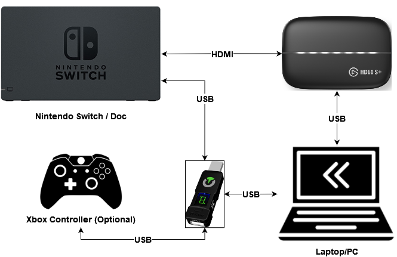

# BDSP Python Bot
___
This repository allows for an easy to use Python API to interface with and program computer-vision based bots for the game Pokemon: Brilliant Diamond / Shining Pearl on the Nintendo Switch.

>NOTE: This setup requires an Elgato Capture card and a Titan One.

| PRODUCT | LINK |
| ------ | ------ |
| Titan One | [Amazon](https://www.amazon.com/dp/B077MLHBM6?psc=1&ref=ppx_yo2_dt_b_product_details) |
| Elgato HD60S+ | [Amazon](https://www.amazon.com/dp/B07XB6VNLJ?psc=1&ref=ppx_yo2_dt_b_product_details) |

___

## User Features

- Encounter count
- Enemy Pokemon name reader
- Auto-hunt Shiny Legendary Pokemon
    - Dialga/Pailka
    - Uxie/Azelf
    - Heatran/Giratina
    - Event Pokemon (like Shaymen & Arceus)
    - Rotom
    - Pal Park Legendaries
    - Crescelia/Mesprit (TBD)
- Auto-SweetScent to catch shiny/nonshiny wild pokemon
    - Useful for mass catching for wonder trade / ability hunts

___

## Developer Features
- Integrate your Twilio account to get instant feedback on shiny alerts to your phone
- Config Files allow for easily changing scripts / setting parameters that are used between scripts
- `utils/` and `scripts/` packages allows for easily contributing new functions without breaking others

___
## Installation
**REQUIREMENTS:** A Windows computer built in the last 5 years & at least a 1080p screen

BDSP Python Bot requires the following software in order to run
- [Anaconda](https://www.anaconda.com/products/individual) to manage Python packages & environment
- [Elgato Capture Utility](https://www.elgato.com/en/downloads) to capture game screen
- [GTuner Pro](https://www.consoletuner.com/downloads/?) to send controller inputs to Switch

Install the conda environment by running `conda_env_installer/installer.bat` 
OR, for a manual installation, create the conda environment from `conda_env_installer/environment.yml`
___
## Hardware Setup

  

  Set up your configuration like the diagram above.

___
## Running your first bot
>Note: For first time setup, follow instructions in italics

 0. *Open up `BDSP-Scripts/Config_Files/global_config.py` and change the `capture_utility_name` to the one you are using*
 *Open up `BDSP-Scripts/Config_Files/global_config.py` and change the `running_script_name` to the one you want to run*
 *Open up GTunerPro and install the MaxAimDI plugin*
 *Open the MaxAimDI plugin & select the controller profile located in `MaxAimDi_Layouts/Nintendo Switch.glf`*
 
 1. Open up your capture utility and verify it is getting a signal from the Switch
 2. Open up GTunerPro and open the MaxAimDI plugin
 3. Drag GTunerPro & MaxAimDI windows to lower right corner of screen (out of the way of the capture card).
 Keep the `Enter Capture Mode` button visible (you will click on this soon)
 4.  Position your character in the game where they need to be.
 For the `stationary_legendary_hunt` script, leave your character 2 squares away & facing up to the legendary pokemon
 5. Double click `start_bot.bat` & position terminal window away from the game capture window
 6. Press `enter` to continue on terminal to start the bot
    QUICKLY click on the `Enter Capture Mode` button in MaxAimDI (you have 3 seconds of leeway by default after pressing `enter`)
7. Congrats, your bot is now running

>Important!
**STOPPING THE BOT:** Leave MaxAimDI capture mode by pressing `ctrl+esc` and quickly close the terminal before it starts typing on whatever active window you have
___
## Development

Want to contribute? Great!

BDSP Python Bot uses many common computer-vision python libraries like:  
- PyAutoGui 
- Win32Gui
- OpenCV 
- PyTesseract
- numpy
- Twilio 

Email [Gunner](https://github.com/GunnerStone) for collaborator access or fork and make your own version!
## License

MIT

